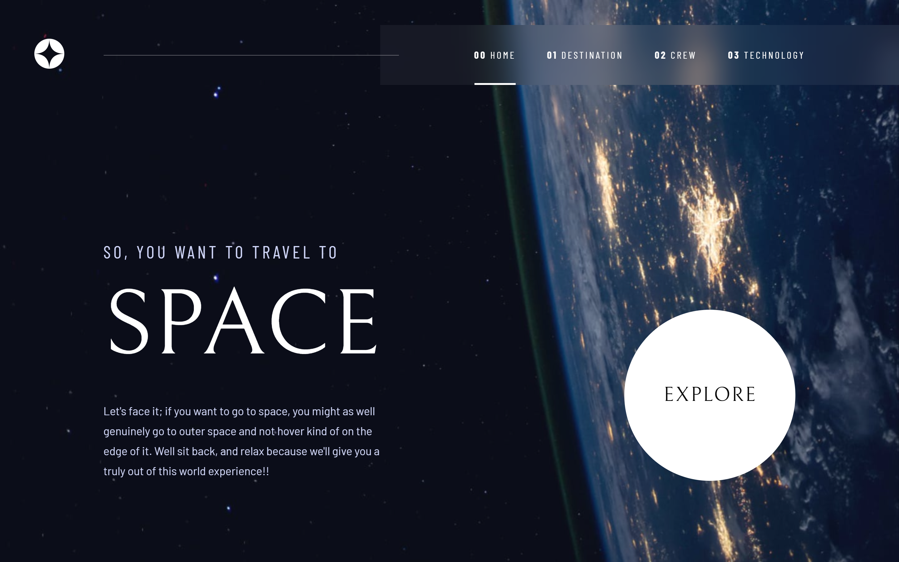

# Space Tourism Website

This project was built using Frontend Mentor coding challenge assets, including Figma design files, optimized image assets, and a local <u>data.json<u> file containing data for all pages. The [challenge](https://www.frontendmentor.io/challenges/space-tourism-multipage-website-gRWj1URZ3) was to build a multi-page space tourism website and match the original design as closely as possible.

## 📌 Pages

- **Home**
- **Destination**
- **Crew**
- **Technology**

## ⚙️ Built With

### Programming Languages

- **JavaScript:**
  High-level programming language for creating dynamic and interactive web environment.
- **HTML:**
  Markup language for defining and structuring web content.
- **CSS:**
  Stylesheet language for designing the website layout and appearance.

### Libraries

- **React:**
  JavaScript library for building user interfaces.
- **AOS (Animate On Scroll):**
  CSS driven scroll animation library to animate elements on scroll.
- **react-router-dom:**
  Lightweight, fully-featured routing library for React.

### Build Tools

- **Vite:**
  Local development server for fast and efficient web development.

### Deployment

- **Netlify:**
  Development platform for deploying and hosting the website.

## 🚀 Live Demo

https://sensational-crepe-7f43cb.netlify.app/

## 👉 Getting Started

&nbsp;&nbsp; **1.** **Clone the repository** --> (git clone /repositoryURL/)

&nbsp;&nbsp; **2.** **Navigate to the project directory** --> (cd space-tourism-website)

&nbsp;&nbsp; **3.** **Install dependencies** --> (npm install)

&nbsp;&nbsp; **4.** **Start the development server** --> (npm run dev)

&nbsp;&nbsp; **5.** **Visit the link in your terminal** --> (CTRL + Click on http://localhost:5173)

## Authors

👩🏻‍💻 Sashka Janevska

- **GitHub:** https://github.com/sashkajanevska

👩🏻‍💻 Aleksandra Gjorchevska

- **GitHub:** https://github.com/alex-7-2

## Show Your Support

Give a ⭐ if you like this project!
